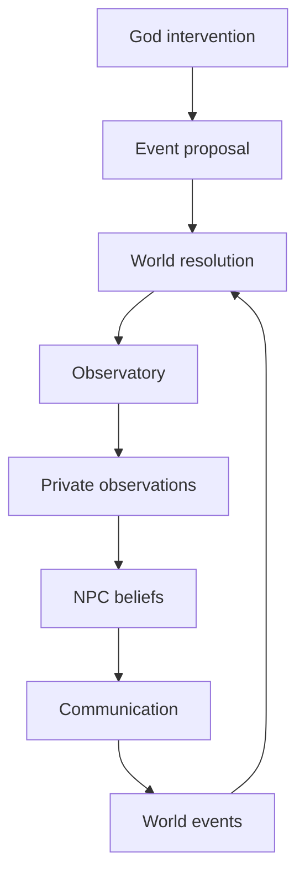

# TinyWorld

TinyWorld is a deterministic, test-first simulation of a small village world. It models NPCs, resources, schedules, interventions, event causality, communication, and read-only research over a single authoritative world state.

The design is intentionally strict:

- the world is the source of truth
- NPC knowledge is private and may be wrong
- communication transfers information without transferring world truth
- the observatory reads data without mutating the simulation

---

## Current architecture



This is the same invariant used by the project today:

- intention is not reality
- proposal is not world truth
- a message is information received, not objective fact
- research observes without changing the simulation

---

## What is implemented

The current project includes these layered systems:

- Genesis world creation from declarative scenarios
- deterministic world generation and metadata setup
- intervention engine for God-driven mutation boundaries
- event proposal, validation, and resolution flow
- private reality through observation and belief filtering
- communication architecture for information transfer
- read-only observatory for inspection, metrics, and checkpointing

### Phase status

- Phase 9: Genesis — complete
- Phase 10: God Intervention Engine — complete
- Phase 11: Private Reality — complete
- Phase 12: Event / Causality Engine — complete
- Phase 13: Communication Architecture — complete
- Phase 14: Observatory / Research Layer — complete

---

## Quick start

From the project root:

```bash
cd D:/tinyworld
python -m pytest -q
```

If you want to run the world entry point directly:

```bash
python -m WORLD.main
```

---

## How to verify the project state

The repository is validated with pytest. The current verified result is:

```bash
python -m pytest -q
```

Current status from this workspace:

- 472 passed
- 1 warning
- 0 test failures

Useful focused checks:

```bash
python -m pytest tests/test_observatory.py -q
python -m pytest tests/test_communication.py -q
python -m pytest tests/test_world.py -q
```

---

## Example inspection flow

You can inspect the world without mutating it:

```python
from WORLD.world import World
from WORLD.Observatory import Observatory

world = World(seed=42)
observatory = Observatory()

snapshot = observatory.inspect_world(world)
print(snapshot.population)
print(snapshot.metadata)
```

You can also compare world truth to NPC private beliefs:

```python
comparisons = observatory.compare_beliefs(world)
for item in comparisons:
    if item.subject == "foreign_army":
        print(item.npc_name, item.npc_value, item.world_value, item.known)
```

---

## Project structure

```text
D:/tinyworld/
├── WORLD/
│   ├── AI/
│   ├── Buildings/
│   ├── Clock/
│   ├── Communication/
│   ├── Economy/
│   ├── Events/
│   ├── Genesis/
│   ├── Interventions/
│   ├── NPCs/
│   ├── Observatory/
│   ├── Resources/
│   ├── Simulation/
│   ├── __init__.py
│   ├── main.py
│   └── world.py
├── tests/
├── README.md
├── pytest.ini
└── .gitignore
```

---

## Determinism and scientific checks

TinyWorld is designed to be reproducible.

A few useful ideas for validation:

- generate the same world from the same scenario and seed
- compare world truth to NPC belief snapshots
- save and restore checkpoints using the observatory
- verify that the observatory does not mutate the underlying world state

The observatory is intentionally read-only:

- it inspects world state
- it records metrics
- it saves checkpoints as value snapshots
- it does not mutate NPC beliefs, world facts, or simulation runtime data

---

## Core rules of the simulation

```text
God proposes an intervention
    ↓
The event is validated and resolved
    ↓
The world updates
    ↓
The observatory inspects without mutating
    ↓
NPCs build private beliefs from observations and communication
    ↓
Information flows without copying objective truth
```

This is the fundamental architecture behind TinyWorld.

---

## Contributing

When changing the world model, prefer:

1. add or update a failing test
2. implement the minimal root-cause fix
3. run the relevant test file
4. run the full suite before claiming completion

This keeps the project deterministic and easy to reason about.

---

## Summary

TinyWorld is no longer just a village simulation. It is a deterministic world model with:

- causal event boundaries
- private NPC reality
- communication as information transfer
- authoritative world state
- research-safe observability

If you want to check the project quickly, the shortest path is:

```bash
python -m pytest -q
```

That is the repository’s current validation command and it is passing in this workspace.
- Environmental events, starting with drought
- 72-hour multi-day emergence tests
- Same-seed reproducibility and different-seed variation

## Core Loop

```text
Decisions
   ↓
Actions
   ↓
World Changes
   ↓
New Conditions
   ↓
New Decisions
```
## Phase 6

### Cognition, Planning & Long-Term Goals

Phase 6 adds continuity to NPC behavior. Instead of deciding only what to do right now, NPCs can pursue goals across multiple ticks and days.

What Phase 6 Adds

Persistent goals with priorities, deadlines, and progress

Multi-step plans and plan execution

Action preconditions and effects

Planning, interruption, and replanning

Beliefs and perception

Memory retrieval

Personality parameters and personality-aware utility

Long-term goals

Multi-day agent trajectories

### agent Flow
```
World State
    ↓
Perception
    ↓
Beliefs
    ↓
Long-Term Goals
    ↓
Plan
    ↓
Decision
    ↓
Action
    ↓
Consequences
    ↓
Memory / Learning
    ↓
Updated Internal State
``` 

Tests: 271 passed

Phase 6 keeps Python deterministic and reality-authoritative while giving NPCs persistent internal state and multi-step behavior.

## Phase 7 — NPC Architecture

Phase 7 is complete: 300 tests passing. No production-code changes were needed for the 7.9 architectural regression suite.

The NPC cognition lifecycle is owned by `Brain`, rather than `AgentSystem`:

```text
World
   ↓
AgentSystem
   ↓
NPC.brain.update()
   ↓
observe
   ↓
think
   ↓
plan
   ↓
reason
   ↓
act
   ↓
reflect
```

Personality is persistent NPC state.

## Phase 9 — Genesis ✅

Phase 9 establishes the boundary between declarative world creation and the
simulation that evolves the resulting world.

```text
                                     GOD
                                       │
                                       ▼
                            WorldScenario
                                       │
                                       ▼
                            WorldGenerator
                                       │
            ┌─────────────────┼─────────────────┐
            ▼                 ▼                 ▼
      Resources         Buildings          Entities
            │                 │                 │
            └─────────────────┼─────────────────┘
                                       │
                   ┌────────────┼────────────┐
                   ▼            ▼            ▼
             Factions       NPCs        Metadata
                                       │
                                       ▼
                                    Brain
                                       │
                                       ▼
                               Simulation
                                       │
                                       ▼
                                 World State
```

### Phase 9 progression

```text
9.1  WorldScenario                  ✓
9.2  Scenario validation            ✓
9.3  WorldGenerator                 ✓
9.4  Generic resource generation    ✓
9.5  Building generation            ✓
9.6  NPC population generation      ✓
9.7  Geography / world entities     ✓
9.8  Factions                       ✓
9.9  Scenario-driven World creation ✓
9.10 Multiple scenario regression   ✓
```

`WorldScenario` describes the initial world. `WorldGenerator` constructs
resources, buildings, entities, factions, metadata, and NPCs. Generated NPCs
use the existing `World.add_npc()` path, so their brains are initialized by the
same architecture as NPCs added to a normal world.

The generator supports generic data with small deterministic vocabularies and
falls back to `generic` for unknown buildings, entities, and factions. Genesis
creates initial state; it does not introduce geography mechanics, faction
politics, or scenario-specific simulation branches.

### Genesis contract

Three substantially different scenarios are generated through the same
`WorldGenerator`:

```text
Coastal settlement ─┐
Mountain settlement ├──→ different generated worlds
Trading settlement  ┘
```

The tested properties are:

```text
same scenario + same seed → same structural world
different scenario        → different structural world
generated World            → accepted by the existing Simulation
World()                   → remains the default construction path
```

The final Phase 9 regression suite reports **405 passing tests**, including
three scenario configurations, one shared generator, deterministic
regeneration, simulation-compatible generated worlds, and plain `World()`
compatibility.

The architectural rule is:

> **God defines. Genesis constructs. Simulation evolves.**

## Phase 10 — God Intervention Engine

Phase 10 adds a generic, deterministic boundary for changing the world while
the simulation is running.

```text
God command
   ↓
GodIntervention
   ↓
InterventionEngine
   ↓
World state mutation
   ↓
Normal simulation
   ↓
NPC perception and cognition
```

Interventions use explicit target namespaces such as:

```text
resource:Food
npc:Rahul
building:General Store
entity:Forest
faction:Regional Ruler
world:metadata.climate
```

The engine supports the core operations:

```text
CREATE              UPDATE              REMOVE
MOVE                SPAWN               DESPAWN
TRIGGER_EVENT       CHANGE_ENVIRONMENT  CHANGE_RESOURCE
CHANGE_RULE         ADVANCE_TIME
```

The `GodIntervention` command is immutable and produces a structured
`InterventionResult`. Failed operations do not partially mutate the world.
Interventions are recorded in a God-side audit history, separate from normal
world events and NPC memories.

For example:

```python
result = world.intervention_engine.apply(
   world,
   GodIntervention(
      operation="change_resource",
      target="resource:Food",
      value=-95,
      visibility="god_only",
   ),
)
```

Food changes use the existing `Resource.add()` and `Resource.consume()` APIs,
so `world.resources["Food"] is world.food` remains true. Spawned NPCs use
`World.add_npc()` and receive normal Brain initialization. Events and
environment changes reuse the existing event log and environment system.

The central observation boundary is:

```text
God changes reality.
NPCs experience reality.
Simulation determines consequences.
```

God-only interventions do not inject commands, provenance, old values, or
explanations into NPC memory, beliefs, or knowledge. NPCs can learn only from
observable consequences through the normal simulation pipeline.

Phase 10 is covered by **427 passing tests**, including resource atomicity,
controlled target resolution, generic creation and removal, NPC movement and
spawning, event and environment integration, rule safety, time advancement,
audit logging, determinism, visibility separation, and full Phase 1-9
regression coverage.

## Phase 11 — Private Reality

Phase 11 separates authoritative World truth from NPC-specific information.
The `ObservationSystem` is the firewall between the two:

```text
World Truth
   ↓
ObservationSystem
   ↓
NPC-specific Observation snapshots
   ↓
Brain / Perception
   ↓
Beliefs, Memory, and Knowledge
```

Observations are immutable value objects. They contain filtered facts rather
than live World references, and are generated separately for each NPC. The
current deterministic policy supports:

- location-based visibility
- symbolic location distance
- separate visual and auditory channels
- a lightweight line-of-sight boundary
- deterministic attention limits
- lossy information such as `perceived_size` instead of hidden exact values

For example, an army with a true size of `500` in the Forest can be visible to
an NPC in the Forest, audible from a nearby Road, and unavailable to an NPC in
a distant Settlement. The nearby observation can report a `large` group without
revealing the exact army size.

The Phase 10 intervention audit remains God-side information. It is not an
observation source and is never copied into NPC memory, beliefs, or knowledge.
World events are also filtered by location rather than delivered to every NPC.

The architectural distinction is:

```text
World truth       = authoritative reality
Observation       = filtered snapshot
Belief            = interpreted internal state
Memory            = retained experience
Knowledge         = accumulated NPC-specific information
God audit         = private intervention history
```

Phase 11 preserves the existing Brain lifecycle, `World()`, Genesis, Phase 10
mutations, and normal simulation ticks. The private-reality regression suite
now reports **441 passing tests**.

## Phase 12 — World Event & Causality Engine

Phase 12 separates an attempted action from an event that actually happened.
NPC actions and selected God operations use the shared event pipeline:

```text
Intent
   ↓
EventProposal
   ↓
EventValidator
   ↓
EventResolver
   ↓
WorldEvent
   ↓
ConsequenceEngine
   ↓
Authoritative World state
   ↓
ObservationSystem
```

`EventProposal` is immutable and does not mutate the World. Validation checks
current authoritative state without changing it. A valid proposal resolves to
a structured, immutable `WorldEvent`; the consequence engine applies the
validated changes, and the existing `EventLog` records the result in
deterministic sequence order. Rejected proposals do not create successful
WorldEvents or partially apply their consequences.

### NPC purchase

An NPC's `SHOP` or planner-generated `OBTAIN_FOOD` intent becomes a purchase
proposal. The validator checks that the NPC is at the shop, stock and quantity
are valid, and the NPC can pay. On success, one `PURCHASE` event records the
item, quantity, and price, then money and Food inventories change together.

```text
Rahul at General Store, money 20
shop Food 10, price 5
            ↓
PURCHASE proposal
            ↓
validation succeeds
            ↓
Rahul money 15; Rahul Food +1
shop money +5; shop Food -1
            ↓
PURCHASE WorldEvent in EventLog
```

An off-site, unaffordable, empty-stock, or invalid-quantity purchase is
rejected without teleporting Rahul or changing either inventory or balance.
The Village schedules explicit store visits; physical location remains a
precondition rather than an implicit side effect.

### God intervention

God spawn, despawn, move, resource-change, and event-trigger requests enter the
same proposal/validation/resolution/consequence path. For example, spawning a
foreign army creates a `SPAWN` WorldEvent and a generic `WorldEntity`; the
`ObservationSystem` then independently filters whether each NPC can perceive
it. The command is not broadcast to NPCs.

```text
GodIntervention: spawn entity:Foreign Army
            ↓
SPAWN WorldEvent
            ↓
Foreign Army enters World at Forest
            ↓
nearby NPC observation; distant NPC receives none
```

The WorldEvent is a record of world reality, not universal NPC knowledge.
EventLog history is not copied into everyone’s memories. God intervention
audit records remain separate from WorldEvent history, and observations contain
filtered snapshots rather than intervention provenance or live entity
references.

Phase 12 uses synchronous deterministic processing and a monotonically assigned
event sequence; no separate event bus, queue, or UUID identity system is
introduced. NPC `EAT`, `SLEEP`, `WORK`, `SHOP`, `OBTAIN_FOOD`, and `SOCIALIZE`
actions use the event pipeline. Farming, restocking, cooperation, and conflict
retain their existing deterministic selection rules, but submit proposals so
the event engine validates and applies their consequences before recording
WorldEvents. Phase 10 metadata/rule/time operations retain their specialized
handlers, while event-like God mutations use the causal pipeline.

Phase 12 is covered by **457 passing tests** across proposal validation,
purchase success and rejection, atomic consequences, God spawn/resource
changes, deterministic event ordering, EventLog integration, observer
filtering, and Phase 1-11 regression coverage.

