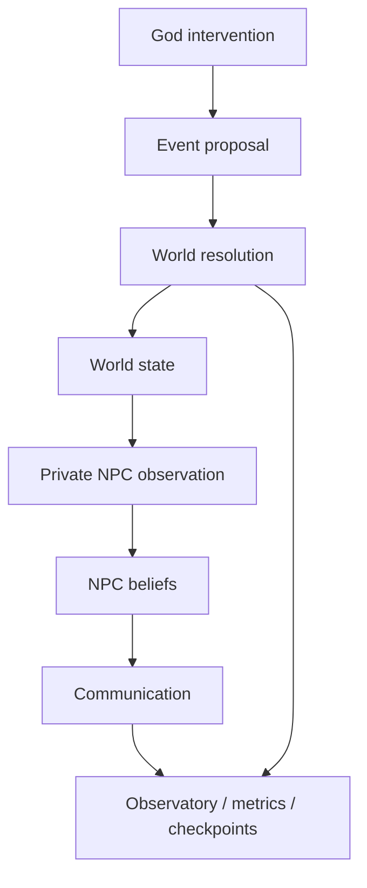

# TinyWorld

TinyWorld is a deterministic, test-first world simulation where the world is the source of truth and NPC knowledge remains private, partial, and sometimes wrong.

The project models the separation between:

- world fact
- intention and proposal
- validated event resolution
- private belief and communication
- scientific observation without mutation

---

## Core architecture



The permanent invariant is:

- what someone intends is not what the world allows
- what the world allows is not what happens
- what happens is not what every NPC knows
- communication transfers information, not objective truth

---

## What is implemented

The repository includes:

- deterministic world generation and Genesis scenarios
- intervention boundaries for God-driven mutation
- proposal, validation, and event resolution flow
- private NPC reality and belief filtering
- communication as data transfer without world-truth transfer
- read-only observatory for inspection, metrics, and checkpoints
- a local FastAPI web app for the God Observatory

### Phase status

- Phase 9: Genesis — complete
- Phase 10: God Intervention Engine — complete
- Phase 11: Private Reality — complete
- Phase 12: Event / Causality Engine — complete
- Phase 13: Communication Architecture — complete
- Phase 14: Observatory / Research Layer — complete
- Phase 15: God MVP / Local Observatory — complete

---

## Quick start

Run the test suite:

```bash
cd D:/tinyworld
python -m pytest -q
```

Start the local web app:

```bash
cd D:/tinyworld
python -m WORLD.app
```

Then open:

```text
http://127.0.0.1:8000/
```

The browser UI talks to the real backend and exposes the world, NPCs, interventions, communication, beliefs, metrics, snapshots, and checkpoint controls without mutating the authoritative world state.

---

## Verified project state

This workspace was validated with:

```bash
python -m pytest -q
```

Result: 476 passed in 1.22s.

Focused app checks also pass:

```bash
python -m pytest tests/test_phase15_app.py -q
```

---

## Example usage

Inspect the world without mutating it:

```python
from WORLD.world import World
from WORLD.Observatory import Observatory

world = World(seed=42)
observatory = Observatory()

snapshot = observatory.inspect_world(world)
print(snapshot.population)
print(snapshot.metadata)
```

Compare reality to an NPC's private beliefs:

```python
comparisons = observatory.compare_beliefs(world)
for item in comparisons:
    if item.subject == "foreign_army":
        print(item.npc_name, item.npc_value, item.world_value, item.known)
```

---

## Local app workflow

1. Start the server with `python -m WORLD.app`
2. Open http://127.0.0.1:8000/
3. Use the observatory sections to inspect the live world
4. Apply interventions from the God control panel
5. Step the simulation and inspect evolving metrics, beliefs, and events
6. Save and restore checkpoints for deterministic replay

---

## Project structure

```text
D:/tinyworld/
├── WORLD/
│   ├── AI/
│   ├── Buildings/
│   ├── Communication/
│   ├── Events/
│   ├── Genesis/
│   ├── Interventions/
│   ├── NPCs/
│   ├── Observatory/
│   ├── Resources/
│   ├── Simulation/
│   ├── static/
│   ├── app.py
│   ├── main.py
│   ├── world.py
│   └── __init__.py
├── tests/
├── README.md
├── pytest.ini
├── .gitignore
└── .tinyworld_checkpoints/
```

---

## Scientific principles

TinyWorld is intentionally built for reproducibility and inspection:

- world state is authoritative
- NPC beliefs are filtered and private
- communication carries information without copying objective truth
- the observatory reads data and records metrics without mutating state
- checkpoints preserve deterministic snapshots for restore-and-continue workflows

---

## Contributing

When changing the simulation, prefer:

1. add or update a failing test
2. fix the root cause
3. run the relevant test file
4. run the full suite before claiming completion

This keeps TinyWorld deterministic, inspectable, and reliable.
