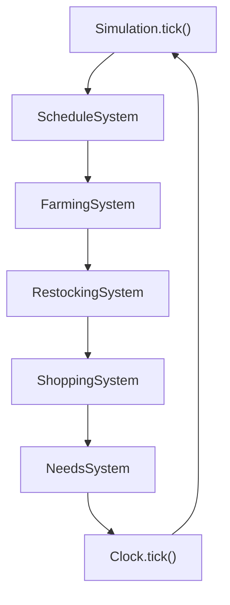

<div align="center">

# 🌱 TinyWorld

### A deterministic village simulation built in Python

Simulate a small village where NPCs work, buy food, eat, and move through time
using simple, testable systems.

<br>


<br><br>

<!-- Replace this image with your simulation GIF -->


<br><br>

[Architecture](#architecture) ·
[Genesis](#phase-9--genesis) ·
[Interventions](#phase-10--god-intervention-engine) ·
[Private Reality](#phase-11--private-reality) ·
[Causality](#phase-12--world-event--causality-engine) ·
[Simulation](#simulation-loop) ·
[Project Structure](#project-structure) ·
[Run](#running-tinyworld) ·
[Tests](#testing) ·
[Roadmap](#roadmap)

</div>

---

## What is TinyWorld?

TinyWorld is a small deterministic village simulation designed around
**explicit state, independent systems, and predictable simulation time**.

The project is being built incrementally. Each feature is introduced as a
small rule, tested independently, and then connected to the larger simulation.

### Current simulation

```text
NPCs
 ├── Roles
 ├── Homes
 ├── Locations
 ├── Food
 ├── Energy
 └── Schedules

World
 ├── Buildings
 ├── Shop
 ├── Food
 ├── NPCs
 └── Systems

Simulation
 └── Tick pipeline
````

---

## ✨ Current Features

| Area         | Current state                         |
| ------------ | ------------------------------------- |
| 👥 NPCs      | Roles, homes, locations, food, energy |
| 🏠 Buildings | Houses, farm, town hall, shop         |
| 🌾 Farming   | Farmers produce food at the farm      |
| 🏪 Shop      | Stores food and handles purchases     |
| 💰 Economy   | Money transfers and food trading      |
| 🍎 Needs     | NPCs consume food and restore energy  |
| 🕐 Clock     | Deterministic simulation time         |
| 📍 Position  | Coordinates and simple movement       |
| 📅 Schedules | Fixed daily NPC schedules             |
| 🧪 Testing   | Unit tests + integration tests        |

---

# Simulation Loop

Each simulation tick processes the current hour before advancing the clock.



### Why the order matters

```text
Schedule
   ↓
NPC reaches destination
   ↓
Farming
   ↓
Food enters village storage
   ↓
Restocking
   ↓
Food enters shop
   ↓
Shopping
   ↓
Food enters NPC inventory
   ↓
Needs
   ↓
Energy changes
```

The systems operate on the state produced by the previous stage.

---

# 🌾 Food Economy

The current food flow is deliberately simple:


### Current rules

```text
12:00
Farmer at Village Farm
        ↓
Produces 2 food

13:00
Village food
        ↓
5 food transferred to shop

19:00
NPC without food
        ↓
Attempts to buy 1 food

20:00
NPC with food
        ↓
Consumes 1 food
        ↓
Restores 20 energy
```

These fixed rules keep Phase 1 deterministic and easy to test.

---

# 🧭 Architecture

TinyWorld separates **state** from **rules**.

```text
                         WORLD
                           │
          ┌────────────────┼────────────────┐
          │                │                │
       Entities         Resources        Buildings
          │                │                │
          └────────────────┼────────────────┘
                           │
                         SYSTEMS
                           │
        ┌──────────┬───────┼────────┬──────────┐
        │          │       │        │          │
    Schedule    Farming  Restock  Shopping   Needs
        │          │       │        │          │
        └──────────┴───────┴────────┴──────────┘
                           │
                       SIMULATION
                           │
                         CLOCK
```

### Core principle

```text
World
  ↓
Systems
  ↓
State transitions
  ↓
Next tick
```

Entities own their state.

Systems own larger behavioral rules.

The simulation controls the order in which those rules run.

---

# 👥 Core Entities

### NPC

An NPC represents a person in the village.

```text
name
role
money
home
location
food
energy
position
schedule
```

NPCs also expose small state-changing operations such as:

```python
npc.move_to(...)
npc.add_food(...)
npc.consume_food(...)
npc.restore_energy(...)
npc.use_energy(...)
npc.eat(...)
```

Larger behaviors are handled by systems rather than being placed entirely inside
the NPC class.

### Building

Generic physical structure with:

```text
name
building_type
money
```

Examples include:

```text
Village Farm
House 1
House 2
Town Hall
```

### Shop

The General Store adds shop-specific state:

```text
name
money
food
food_price
```

### Resource

Resources represent quantities such as food.

```python
food.add(amount)
food.consume(amount)
```

Resource validation prevents invalid quantities such as negative food.

### Position

NPCs use simple coordinates:

```text
x
y
```

Phase 1 intentionally uses simple movement rather than full pathfinding.

---

# ⚙️ Systems

TinyWorld currently uses small systems with focused responsibilities.

| System             | Responsibility                      |
| ------------------ | ----------------------------------- |
| `ScheduleSystem`   | Applies NPC schedules               |
| `FarmingSystem`    | Produces village food               |
| `RestockingSystem` | Moves village food into the shop    |
| `ShoppingSystem`   | Handles NPC food purchases          |
| `NeedsSystem`      | Handles food consumption and energy |

This keeps individual rules isolated and makes them easier to test.

---

# 🏘️ Example Day

```text
08:00  NPC schedules update
   │
   ▼
12:00  Farmers produce food
   │
   ▼
13:00  Village food → Shop
   │
   ▼
19:00  NPCs buy food
   │
   ▼
20:00  NPCs consume food
   │
   ▼
00:00  Next day
```

The simulation clock is independent of real-world time, so a test can start
directly at a specific hour.

```python
world.clock.hour = 12
```

This makes the simulation deterministic and reproducible.

---

# 📁 Project Structure

```text
tinyworld/
│
├── WORLD/
│   ├── __init__.py
│   ├── main.py
│   ├── world.py
│   │
│   ├── Buildings/
│   ├── Clock/
│   ├── Economy/
│   ├── Entities/
│   ├── Farming/
│   ├── Factions/
│   ├── Genesis/
│   ├── Interventions/
│   ├── Map/
│   ├── Needs/
│   ├── NPCs/
│   ├── Resources/
│   ├── Restocking/
│   ├── Schedules/
│   ├── Shopping/
│   ├── Simulation/
│   └── Village/
│
├── tests/
│
├── pytest.ini
└── README.md
```

---

# 🧪 Testing

The project uses both **unit tests** and **integration tests**.

### Unit tests

Individual systems are tested with small controlled environments.

For example:

```text
FakeWorld
FakeClock
NPC
Resource
```

This allows a system to be tested without constructing the entire simulation.

### Integration tests

Integration tests verify that the actual systems work together through the
simulation pipeline.

The idea is simple:

```text
Unit tests
    ↓
Verify individual rules

Integration tests
    ↓
Verify system connections
```

---

# 🚀 Running TinyWorld

Clone the repository and run the simulation from the project root:

```bash
python -m WORLD.main
```

---

# ✅ Running Tests

Run the complete test suite:

```bash
pytest -v
```

Run an individual module:

```bash
pytest -v tests/test_simulation.py
```

Other useful modules include:

```bash
pytest -v tests/test_farming.py
pytest -v tests/test_needs.py
pytest -v tests/test_shopping.py
pytest -v tests/test_restocking.py
```

---

# 📊 Simulation Invariants

The current simulation relies on a few important rules.

### Money conservation

Normal money transfers should satisfy:

```text
money before = money after
```

### Food conservation during restocking

Restocking moves food rather than creating it:

```text
village food before + shop food before
=
village food after + shop food after
```

### Valid state

```text
Food >= 0
Energy <= 100
```

### Determinism

Given the same:

```text
starting state
+ same rules
+ same ticks
```

the simulation should produce the same result.

---

# 🛠️ Development Approach

TinyWorld is intentionally built in small layers:

```text
1. Model state
2. Add a rule
3. Test the rule
4. Connect the rule
5. Test the connection
6. Run the simulation
```

The goal is to increase complexity through **small, testable systems** rather
than a single large simulation class.

---

# 🗺️ Roadmap

### Phase 1

* [x] NPCs
* [x] Buildings
* [x] Resources
* [x] Money
* [x] Position
* [x] Clock
* [x] Schedules
* [x] Farming
* [x] Restocking
* [x] Shopping
* [x] Needs / food consumption
* [x] Simulation pipeline


## Phase 2 — Needs, Energy & Economy ✅

Phase 2 introduced consequences and connected the village systems into a basic resource loop.

### Added
- NPC energy and hunger
- Food ownership and consumption
- Work and energy costs
- Rest and energy recovery
- Farmer productivity based on energy
- Farming and food production
- Shop restocking
- NPC food purchases
- Money transfers and trading
- Deterministic full-day simulation

### Food Flow
```text
Farm → Village Food → Shop → NPC → Eat
```

### Simulation Loop
Schedule
→ Work
→ Farming
→ Restocking
→ Shopping
→ Needs
→ Rest
→ Clock
### Core Feedback Loop
Food shortage
→ Hunger increases
→ Energy decreases
→ Productivity falls
→ Food production decreases
### Testing
Added unit tests for Phase 2 systems
Added a deterministic 24-hour integration test
Full test suite: 76 tests passed

## Phase 3 — NPC Relationships & Memory ✅

Phase 3 introduced persistent social state to NPCs.

### Added
- NPC relationships with bounded values from -100 to +100
- NPC memories with day, hour, event, and importance
- Bounded memory storage
- SocialSystem for basic NPC interactions
- Interactions increase relationships
- Interactions create memories
- Social state persists across multiple days

### Social Flow
```text
NPCs share location
→ interaction
→ relationship changes
→ memory created
→ state persists
```

### Testing
Added relationship unit tests
Added memory unit tests
Added social interaction tests
Added multi-day social persistence integration test
Full test suite passes


## Phase 4 — Goals & Decision Making 

Phase 4 adds a deterministic AI decision layer for NPC behavior.

### Added

- Goal-based NPC behavior
- Candidate action selection
- Deterministic utility scoring
- DecisionSystem for choosing actions
- AgentSystem for central NPC decision execution
- ActionExecutor for applying chosen actions
- Decision-aware eating, shopping, working, sleeping, and socializing
- Schedule influence on decisions
- Relationship influence on social decisions
- Memory influence on social decisions
- Decision debugging with action scores
- Multi-day social behavior persistence

### Decision Flow

```text
NPC State
   ↓
GoalSystem
   ↓
Candidate Actions
   ↓
DecisionSystem
   ↓
Utility Scores
   ↓
Chosen Action
   ↓
ActionExecutor
   ↓
World State
   ↓
Next Tick

```

## Phase 5 (turns TinyWorld into a feedback-driven simulation)

## What was added

- World events and event logging
- Work attendance and productivity effects
- Dynamic food pricing
- Price-aware NPC decisions
- Cooperation and conflict
- Reputation and relationship changes
- Cascading consequences
- Seeded randomness
- Environmental events, starting with drought
- 72-hour multi-day emergence tests
- Same-seed reproducibility and different-seed variation

## Core Loop

```text
Decisions
   ↓
Actions
   ↓
World Changes
   ↓
New Conditions
   ↓
New Decisions
```
## Phase 6

### Cognition, Planning & Long-Term Goals

Phase 6 adds continuity to NPC behavior. Instead of deciding only what to do right now, NPCs can pursue goals across multiple ticks and days.

What Phase 6 Adds

Persistent goals with priorities, deadlines, and progress

Multi-step plans and plan execution

Action preconditions and effects

Planning, interruption, and replanning

Beliefs and perception

Memory retrieval

Personality parameters and personality-aware utility

Long-term goals

Multi-day agent trajectories

### agent Flow
```
World State
    ↓
Perception
    ↓
Beliefs
    ↓
Long-Term Goals
    ↓
Plan
    ↓
Decision
    ↓
Action
    ↓
Consequences
    ↓
Memory / Learning
    ↓
Updated Internal State
``` 

Tests: 271 passed

Phase 6 keeps Python deterministic and reality-authoritative while giving NPCs persistent internal state and multi-step behavior.

## Phase 7 — NPC Architecture

Phase 7 is complete: 300 tests passing. No production-code changes were needed for the 7.9 architectural regression suite.

The NPC cognition lifecycle is owned by `Brain`, rather than `AgentSystem`:

```text
World
   ↓
AgentSystem
   ↓
NPC.brain.update()
   ↓
observe
   ↓
think
   ↓
plan
   ↓
reason
   ↓
act
   ↓
reflect
```

Personality is persistent NPC state.

## Phase 9 — Genesis ✅

Phase 9 establishes the boundary between declarative world creation and the
simulation that evolves the resulting world.

```text
                                     GOD
                                       │
                                       ▼
                            WorldScenario
                                       │
                                       ▼
                            WorldGenerator
                                       │
            ┌─────────────────┼─────────────────┐
            ▼                 ▼                 ▼
      Resources         Buildings          Entities
            │                 │                 │
            └─────────────────┼─────────────────┘
                                       │
                   ┌────────────┼────────────┐
                   ▼            ▼            ▼
             Factions       NPCs        Metadata
                                       │
                                       ▼
                                    Brain
                                       │
                                       ▼
                               Simulation
                                       │
                                       ▼
                                 World State
```

### Phase 9 progression

```text
9.1  WorldScenario                  ✓
9.2  Scenario validation            ✓
9.3  WorldGenerator                 ✓
9.4  Generic resource generation    ✓
9.5  Building generation            ✓
9.6  NPC population generation      ✓
9.7  Geography / world entities     ✓
9.8  Factions                       ✓
9.9  Scenario-driven World creation ✓
9.10 Multiple scenario regression   ✓
```

`WorldScenario` describes the initial world. `WorldGenerator` constructs
resources, buildings, entities, factions, metadata, and NPCs. Generated NPCs
use the existing `World.add_npc()` path, so their brains are initialized by the
same architecture as NPCs added to a normal world.

The generator supports generic data with small deterministic vocabularies and
falls back to `generic` for unknown buildings, entities, and factions. Genesis
creates initial state; it does not introduce geography mechanics, faction
politics, or scenario-specific simulation branches.

### Genesis contract

Three substantially different scenarios are generated through the same
`WorldGenerator`:

```text
Coastal settlement ─┐
Mountain settlement ├──→ different generated worlds
Trading settlement  ┘
```

The tested properties are:

```text
same scenario + same seed → same structural world
different scenario        → different structural world
generated World            → accepted by the existing Simulation
World()                   → remains the default construction path
```

The final Phase 9 regression suite reports **405 passing tests**, including
three scenario configurations, one shared generator, deterministic
regeneration, simulation-compatible generated worlds, and plain `World()`
compatibility.

The architectural rule is:

> **God defines. Genesis constructs. Simulation evolves.**

## Phase 10 — God Intervention Engine

Phase 10 adds a generic, deterministic boundary for changing the world while
the simulation is running.

```text
God command
   ↓
GodIntervention
   ↓
InterventionEngine
   ↓
World state mutation
   ↓
Normal simulation
   ↓
NPC perception and cognition
```

Interventions use explicit target namespaces such as:

```text
resource:Food
npc:Rahul
building:General Store
entity:Forest
faction:Regional Ruler
world:metadata.climate
```

The engine supports the core operations:

```text
CREATE              UPDATE              REMOVE
MOVE                SPAWN               DESPAWN
TRIGGER_EVENT       CHANGE_ENVIRONMENT  CHANGE_RESOURCE
CHANGE_RULE         ADVANCE_TIME
```

The `GodIntervention` command is immutable and produces a structured
`InterventionResult`. Failed operations do not partially mutate the world.
Interventions are recorded in a God-side audit history, separate from normal
world events and NPC memories.

For example:

```python
result = world.intervention_engine.apply(
   world,
   GodIntervention(
      operation="change_resource",
      target="resource:Food",
      value=-95,
      visibility="god_only",
   ),
)
```

Food changes use the existing `Resource.add()` and `Resource.consume()` APIs,
so `world.resources["Food"] is world.food` remains true. Spawned NPCs use
`World.add_npc()` and receive normal Brain initialization. Events and
environment changes reuse the existing event log and environment system.

The central observation boundary is:

```text
God changes reality.
NPCs experience reality.
Simulation determines consequences.
```

God-only interventions do not inject commands, provenance, old values, or
explanations into NPC memory, beliefs, or knowledge. NPCs can learn only from
observable consequences through the normal simulation pipeline.

Phase 10 is covered by **427 passing tests**, including resource atomicity,
controlled target resolution, generic creation and removal, NPC movement and
spawning, event and environment integration, rule safety, time advancement,
audit logging, determinism, visibility separation, and full Phase 1-9
regression coverage.

## Phase 11 — Private Reality

Phase 11 separates authoritative World truth from NPC-specific information.
The `ObservationSystem` is the firewall between the two:

```text
World Truth
   ↓
ObservationSystem
   ↓
NPC-specific Observation snapshots
   ↓
Brain / Perception
   ↓
Beliefs, Memory, and Knowledge
```

Observations are immutable value objects. They contain filtered facts rather
than live World references, and are generated separately for each NPC. The
current deterministic policy supports:

- location-based visibility
- symbolic location distance
- separate visual and auditory channels
- a lightweight line-of-sight boundary
- deterministic attention limits
- lossy information such as `perceived_size` instead of hidden exact values

For example, an army with a true size of `500` in the Forest can be visible to
an NPC in the Forest, audible from a nearby Road, and unavailable to an NPC in
a distant Settlement. The nearby observation can report a `large` group without
revealing the exact army size.

The Phase 10 intervention audit remains God-side information. It is not an
observation source and is never copied into NPC memory, beliefs, or knowledge.
World events are also filtered by location rather than delivered to every NPC.

The architectural distinction is:

```text
World truth       = authoritative reality
Observation       = filtered snapshot
Belief            = interpreted internal state
Memory            = retained experience
Knowledge         = accumulated NPC-specific information
God audit         = private intervention history
```

Phase 11 preserves the existing Brain lifecycle, `World()`, Genesis, Phase 10
mutations, and normal simulation ticks. The private-reality regression suite
now reports **441 passing tests**.

## Phase 12 — World Event & Causality Engine

Phase 12 separates an attempted action from an event that actually happened.
NPC actions and selected God operations use the shared event pipeline:

```text
Intent
   ↓
EventProposal
   ↓
EventValidator
   ↓
EventResolver
   ↓
WorldEvent
   ↓
ConsequenceEngine
   ↓
Authoritative World state
   ↓
ObservationSystem
```

`EventProposal` is immutable and does not mutate the World. Validation checks
current authoritative state without changing it. A valid proposal resolves to
a structured, immutable `WorldEvent`; the consequence engine applies the
validated changes, and the existing `EventLog` records the result in
deterministic sequence order. Rejected proposals do not create successful
WorldEvents or partially apply their consequences.

### NPC purchase

An NPC's `SHOP` or planner-generated `OBTAIN_FOOD` intent becomes a purchase
proposal. The validator checks that the NPC is at the shop, stock and quantity
are valid, and the NPC can pay. On success, one `PURCHASE` event records the
item, quantity, and price, then money and Food inventories change together.

```text
Rahul at General Store, money 20
shop Food 10, price 5
            ↓
PURCHASE proposal
            ↓
validation succeeds
            ↓
Rahul money 15; Rahul Food +1
shop money +5; shop Food -1
            ↓
PURCHASE WorldEvent in EventLog
```

An off-site, unaffordable, empty-stock, or invalid-quantity purchase is
rejected without teleporting Rahul or changing either inventory or balance.
The Village schedules explicit store visits; physical location remains a
precondition rather than an implicit side effect.

### God intervention

God spawn, despawn, move, resource-change, and event-trigger requests enter the
same proposal/validation/resolution/consequence path. For example, spawning a
foreign army creates a `SPAWN` WorldEvent and a generic `WorldEntity`; the
`ObservationSystem` then independently filters whether each NPC can perceive
it. The command is not broadcast to NPCs.

```text
GodIntervention: spawn entity:Foreign Army
            ↓
SPAWN WorldEvent
            ↓
Foreign Army enters World at Forest
            ↓
nearby NPC observation; distant NPC receives none
```

The WorldEvent is a record of world reality, not universal NPC knowledge.
EventLog history is not copied into everyone’s memories. God intervention
audit records remain separate from WorldEvent history, and observations contain
filtered snapshots rather than intervention provenance or live entity
references.

Phase 12 uses synchronous deterministic processing and a monotonically assigned
event sequence; no separate event bus, queue, or UUID identity system is
introduced. NPC `EAT`, `SLEEP`, `WORK`, `SHOP`, `OBTAIN_FOOD`, and `SOCIALIZE`
actions use the event pipeline. Farming, restocking, cooperation, and conflict
retain their existing deterministic selection rules, but submit proposals so
the event engine validates and applies their consequences before recording
WorldEvents. Phase 10 metadata/rule/time operations retain their specialized
handlers, while event-like God mutations use the causal pipeline.

Phase 12 is covered by **457 passing tests** across proposal validation,
purchase success and rejection, atomic consequences, God spawn/resource
changes, deterministic event ordering, EventLog integration, observer
filtering, and Phase 1-11 regression coverage.

